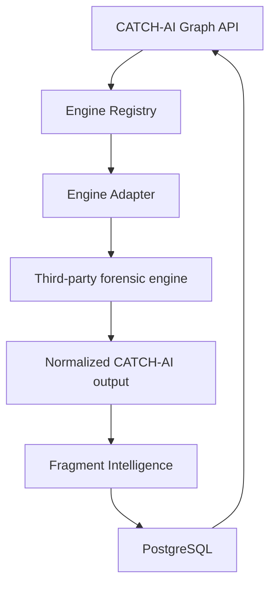

# CATCH-AI Forensic Engine Integration

## Architecture

CATCH-AI acts as the unified integration layer for multiple specialized forensic engines. The frontend and API never interact directly with third-party tools; instead, everything goes through our Engine Adapters and Registry.

## Authorized Integrations
- **PyTSK3**: Filesystem-aware recovery
- **DeepRecover**: Filesystem fallback recovery
- **SleuthKit**: Partition forensic analysis
- **Libewf**: Image handling
- **PhotoRec**: Raw carving
- **Plaso**: Timeline generation
- **CompDec**: Binary analysis
- **ForensicAI**: ML features
